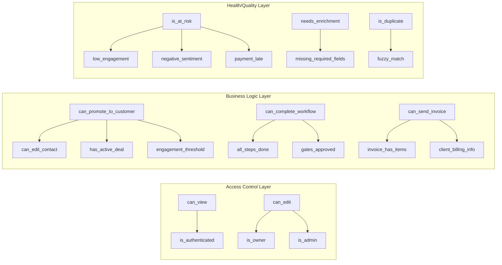

# OMAR Domain Interconnection Map

This diagram shows how all domains connect through PXYZ coordinate operations.

```mermaid
graph TB
    subgraph "P-Axis: Entities"
        Contact[Contact<br/>P=contact]
        Task[Task<br/>P=task]
        Workflow[Workflow<br/>P=workflow]
        Email[Email<br/>P=email]
        Note[Note<br/>P=note]
        Document[Document<br/>P=document]
        Invoice[Invoice<br/>P=invoice]
        File[File<br/>P=file]
        Portal[Portal<br/>P=portal]
    end
    
    subgraph "X-Axis: Operations (via graph.bin)"
        CRUD["CRUD Ops<br/>create/read/update/delete"]
        Search["Search Ops<br/>search/list/filter"]
        Transform["Transform Ops<br/>stage_transition/convert"]
        AI["AI Ops<br/>summarize/draft/extract"]
        Comms["Comms Ops<br/>send/notify/message"]
    end
    
    subgraph "Y-Axis: Predicates (constraints)"
        Auth["Access Control<br/>can_view/can_edit"]
        Lifecycle["Lifecycle Rules<br/>can_promote/is_valid"]
        Health["Health Checks<br/>is_overdue/at_risk"]
        Quality["Data Quality<br/>is_duplicate/needs_enrichment"]
    end
    
    subgraph "Z-Axis: Events (append-only log)"
        EventLog["Event Log<br/>All state changes"]
    end
    
    subgraph "Execution Layer"
        WASM["pxyz.wasm<br/>~500 lines WAT<br/>Graph Traversal Engine"]
        GraphBin["graph.bin<br/>Compiled Workflows"]
        IO["IO Adapter<br/>~200 lines<br/>Platform-specific"]
    end
    
    %% Circular Evolution Flows
    Email -->|"X=to_task"| Task
    Task -->|"X=to_workflow"| Workflow
    Workflow -->|"X=to_invoice"| Invoice
    Note -->|"X=to_task"| Task
    Note -->|"X=to_document"| Document
    Email -->|"X=to_contact"| Contact
    
    %% Integration Flows
    Contact -->|"X=timeline"| Email
    Contact -->|"X=workflow_enroll"| Workflow
    Task -->|"X=link_contact"| Contact
    Workflow -->|"X=generate_tasks"| Task
    Invoice -->|"X=from_workflow"| Workflow
    Document -->|"X=share_portal"| Portal
    File -->|"X=attach_document"| Document
    
    %% All entities use operations
    Contact -.->|uses| CRUD
    Task -.->|uses| CRUD
    Workflow -.->|uses| Search
    Email -.->|uses| AI
    Note -.->|uses| Transform
    
    %% All operations checked by predicates
    CRUD -.->|constrained by| Auth
    Transform -.->|constrained by| Lifecycle
    Search -.->|constrained by| Auth
    
    %% All operations append events
    CRUD ==>|appends to| EventLog
    Transform ==>|appends to| EventLog
    AI ==>|appends to| EventLog
    
    %% Execution flow
    WASM -->|loads| GraphBin
    WASM -->|calls| IO
    GraphBin -->|contains| Auth
    GraphBin -->|contains| Lifecycle
    IO ==>|writes| EventLog
    
    style Contact fill:#e1f5ff
    style Task fill:#fff4e1
    style Workflow fill:#e7ffe1
    style Email fill:#ffe1f5
    style Note fill:#f5e1ff
    style Document fill:#e1ffe7
    style Invoice fill:#ffe1e1
    style File fill:#e1e1ff
    style Portal fill:#fffce1
    
    style WASM fill:#ff6b6b
    style EventLog fill:#4ecdc4
    style GraphBin fill:#95e1d3
```



## Domain Operation Matrix

| Entity | Create | Search | Transform | AI-Enhanced | Events |
|--------|--------|--------|-----------|-------------|--------|
| **Contact** | `0x0100` | `0x0105` | `0x0113` (stage) | `0x0121` (health) | contact.created, contact.stage_changed |
| **Task** | `0x0200` | `0x0205` | `0x0210` (state) | `0x0212` (subtasks) | task.created, task.state_changed |
| **Workflow** | `0x0400` | `0x0405` | `0x0420` (phase) | `0x0440` (health) | workflow.started, workflow.completed |
| **Email** | `0x0506` | `0x0505` | `0x0520` (to_task) | `0x0530` (summarize) | email.sent, email.received |
| **Note** | `0x0700` | `0x0705` | `0x0720` (to_task) | `0x0730` (extract) | note.created, note.evolved |
| **Document** | `0x0600` | `0x0605` | `0x0640` (template) | `0x0641` (ai_draft) | document.created, document.approved |
| **Invoice** | `0x0800` | N/A | `0x0820` (from_tasks) | `0x0840` (line_items) | invoice.created, invoice.paid |
| **File** | `0x1000` | `0x1005` | `0x1010` (link) | `0x1020` (tag) | file.uploaded, file.shared |
| **Portal** | `0x0900` (login) | N/A | `0x0920` (approve) | N/A | portal.login, portal.approved |

## Key Circular Evolution Paths

### Path 1: Email → Task → Workflow → Invoice
```
1. Email arrives (P=email, X=receive, Z=now)
   ↓
2. AI detects action (X=0x0801 classify)
   ↓
3. Create task (P=task, X=create, Y={source_email_id})
   ↓
4. Task grows complex (predicate: should_promote_to_workflow)
   ↓
5. Create workflow (P=workflow, X=create, Y={source_task_id})
   ↓
6. Workflow completes (X=complete, Y={billable=true})
   ↓
7. Generate invoice (P=invoice, X=from_workflow, Y={workflow_id})
```

### Path 2: Note → Document → Portal → Approval
```
1. Note created (P=note, X=create)
   ↓
2. Note grows (length > 500 chars)
   ↓
3. Convert to document (P=document, X=create, Y={source_note_id})
   ↓
4. Apply template (X=from_template)
   ↓
5. Share to portal (P=portal, X=publish, Y={document_id})
   ↓
6. Client approves (P=portal, X=approve)
   ↓
7. Workflow gate clears (P=workflow, X=phase_transition)
```

### Path 3: Contact → Email → Meeting → Task → Invoice
```
1. Contact created (P=contact, X=create)
   ↓
2. Email sent (P=email, X=send, Y={to_contact_id})
   ↓
3. Meeting scheduled (AI suggests from email)
   ↓
4. Meeting note created (P=note, X=create, Y={meeting_id})
   ↓
5. Action items extracted (X=ai_extract)
   ↓
6. Tasks created (P=task, X=create, Y={source_note_id})
   ↓
7. Tasks completed (X=state_transition, Y={new_state=done})
   ↓
8. Invoice generated (P=invoice, X=from_tasks)
```

## Predicate Dependency Graph



## Event Sourcing Architecture

```
┌─────────────────────────────────────────────────────┐
│  USER ACTION: "Search contacts for Acme"           │
└─────────────────────┬───────────────────────────────┘
                      │
                      ▼
┌─────────────────────────────────────────────────────┐
│  PXYZ Coordinate: /pxyz/contact/search?query=Acme  │
└─────────────────────┬───────────────────────────────┘
                      │
                      ▼
┌─────────────────────────────────────────────────────┐
│  WASM Runtime loads graph.bin                       │
│  Finds entry: P=contact, X=search                   │
└─────────────────────┬───────────────────────────────┘
                      │
                      ▼
┌─────────────────────────────────────────────────────┐
│  Graph Traversal:                                   │
│    1. validate_search (transform)                   │
│    2. auth_search (check is_authenticated)          │
│    3. execute_search (external op 0x0105)           │
│    4. filter_results (apply can_view_contact)       │
│    5. compute_momentum (external op 0x0122)         │
│    6. render_results (template)                     │
│    7. success (terminal)                            │
└─────────────────────┬───────────────────────────────┘
                      │
                      ▼
┌─────────────────────────────────────────────────────┐
│  IO Adapter executes external ops:                  │
│    - 0x0105: Query Qdrant + IndexedDB               │
│    - 0x0122: Calculate momentum scores              │
└─────────────────────┬───────────────────────────────┘
                      │
                      ▼
┌─────────────────────────────────────────────────────┐
│  Results projected from event log:                  │
│    contact.id, contact.name, contact.email,         │
│    computed.health_score, computed.momentum         │
└─────────────────────┬───────────────────────────────┘
                      │
                      ▼
┌─────────────────────────────────────────────────────┐
│  SSE Response to Datastar:                          │
│    event: datastar-merge-fragments                  │
│    data: selector #results                          │
│    data: fragment <div>...contacts...</div>         │
└─────────────────────┬───────────────────────────────┘
                      │
                      ▼
┌─────────────────────────────────────────────────────┐
│  DOM Updated - User sees results                    │
└─────────────────────────────────────────────────────┘
```

## State Projection Formula

For any entity at any time:

```typescript
State(entity_id, t) = Reduce(
  EventLog.query({
    entity_id: entity_id,
    timestamp: { $lte: t }
  }),
  initialState,
  (state, event) => applyEvent(state, event)
)

// Example: Contact health score
ContactState(id, now) = {
  id: id,
  name: last(events.where(type='contact.updated', field='name')),
  email: last(events.where(type='contact.updated', field='email')),
  stage: last(events.where(type='contact.stage_changed')).new_stage,
  health_score: calculateHealth(
    events.where(entity_id=id, 
                 type IN ['email.sent', 'email.received', 'meeting.held'],
                 timestamp > now - 90.days)
  ),
  momentum: calculateMomentum(
    events.where(entity_id=id, timestamp > now - 30.days)
  )
}
```

**Key Insight**: There is no "contacts table" with a "health_score column". The health score is COMPUTED on demand from the event log. This is what "state is a lie" means.

## Complete System Flow

```
User Browser (Datastar)
      ↓ HTTP Request: /pxyz/contact/search?query=Acme
      ↓
┌─────────────────────────────────────┐
│  WASM Runtime (pxyz.wasm)          │
│  • Load graph.bin into memory       │
│  • Parse PXYZ coordinates           │
│  • Find entry node                  │
│  • Begin graph traversal            │
└──────────┬──────────────────────────┘
           │
           ├─→ Node: validate_search
           │   • Type: transform
           │   • Check schema
           │   ↓
           ├─→ Node: auth_search
           │   • Type: auth
           │   • Eval predicate: is_authenticated
           │   • Bytecode VM execution
           │   ↓
           ├─→ Node: execute_search
           │   • Type: external
           │   • Op code: 0x0105
           │   • Call IO adapter ──────┐
           │   ↓                        │
           │                            ↓
           │                  ┌─────────────────────┐
           │                  │  IO Adapter         │
           │                  │  • Qdrant search    │
           │                  │  • IndexedDB query  │
           │                  │  • Merge results    │
           │                  └──────────┬──────────┘
           │   ↑                         │
           │   └─────────────────────────┘
           │   ↓
           ├─→ Node: filter_results
           │   • Type: transform
           │   • Eval predicate: can_view_contact
           │   • For each result
           │   ↓
           ├─→ Node: compute_momentum
           │   • Type: external
           │   • Op code: 0x0122
           │   • Query event log ──────┐
           │   ↓                        │
           │                            ↓
           │                  ┌─────────────────────┐
           │                  │  Event Log          │
           │                  │  • Filter by entity │
           │                  │  • Filter by type   │
           │                  │  • Filter by time   │
           │                  │  • Calculate        │
           │                  └──────────┬──────────┘
           │   ↑                         │
           │   └─────────────────────────┘
           │   ↓
           ├─→ Node: render_results
           │   • Type: render
           │   • Apply template
           │   • Generate HTML
           │   ↓
           └─→ Node: success
               • Type: terminal
               • Return status 200
               • Return HTML fragment
               ↓
┌─────────────────────────────────────┐
│  SSE Response                       │
│  event: datastar-merge-fragments    │
│  data: selector #results            │
│  data: fragment <div>...</div>      │
└──────────┬──────────────────────────┘
           ↓
User Browser (Datastar patches DOM)
```

## The 700-Line System

```
Total Lines of Auditable Code:

pxyz.wat (Runtime)           ~500 lines
compiler.ts (XML → binary)   ~600 lines
io-browser.ts (IO adapter)   ~200 lines
─────────────────────────────────────
TOTAL                       ~1,300 lines
═════════════════════════════════════

Everything else is DATA:
• graph.bin (compiled workflows)
• workflow.xml (business logic)
• Event log (append-only truth)

Dependencies: ZERO
Bundle size: ~15KB
Attack surface: 1,300 auditable lines
```

This is OMAR.
