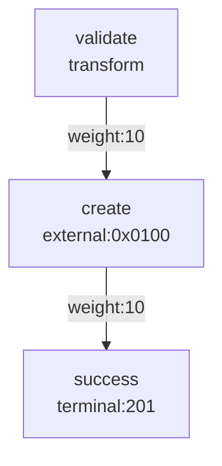

# OMAR/PXYZ Unified System Reference

> **Last Updated**: November 2024  
> **Version**: 1.0 (Pre-Alpha)  
> **Status**: Active Development

---

## Table of Contents

1. [Executive Summary](#executive-summary)
2. [Core Philosophy](#core-philosophy)
3. [Architecture Overview](#architecture-overview)
4. [The PXYZ Coordinate System](#the-pxyz-coordinate-system)
5. [XML Workflow Language](#xml-workflow-language)
6. [Binary Format Specification](#binary-format-specification)
7. [Predicate Virtual Machine](#predicate-virtual-machine)
8. [IO Operation Codes](#io-operation-codes)
9. [Three-Layer Validation System](#three-layer-validation-system)
10. [Safety Guarantees](#safety-guarantees)
11. [Development Workflow](#development-workflow)
12. [Type System Philosophy](#type-system-philosophy)
13. [Frontend Integration (Datastar)](#frontend-integration-datastar)
14. [Future: Self-Learning Automation](#future-self-learning-automation)
15. [Migration from TypeScript](#migration-from-typescript)
16. [Implementation Status](#implementation-status)
17. [Quick Reference](#quick-reference)

---

## Executive Summary

### What is OMAR/PXYZ?

OMAR (formerly Omar) is an **AI-native CRM system** built on a revolutionary PXYZ 4D coordinate architecture. It fundamentally reimagines business software by treating **operations as coordinate-addressable graph traversals** rather than traditional imperative code.

### Core Innovation

Instead of writing code that mutates state, OMAR treats:
- **Business logic as data** (finite, auditable graphs)
- **State as projections** over event history and constraints
- **All operations as coordinates** in 4D space (P, X, Y, Z)

This enables:
- **Complete static analysis** before deployment
- **Guaranteed termination** of all operations
- **Impossible-to-hide side effects**
- **Minimal attack surface** (~700 lines of auditable code)
- **Hot-reloadable business logic** without downtime

### Key Metrics

| Metric | Value | Traditional Systems |
|--------|-------|---------------------|
| Runtime Code | ~700 lines (WAT + Rust) | 250KB+ JavaScript |
| Dependencies | 0 | Hundreds (npm) |
| Attack Surface | Fully auditable in hours | Months to audit |
| Bundle Size | ~15KB (wasm + graph) | Megabytes |
| Termination | Mathematically guaranteed | Turing-complete risk |

---

## Core Philosophy

### The Three Axioms

1. **State Is A Lie**
   ```
   State = View(History, Constraints)
   ```
   If you can't rebuild it from events (Z) and rules (Y), it doesn't exist.

2. **Everything Is Events Or Constraints**
   - UI state? Projection over event log
   - Database rows? Projection over event log
   - API responses? Projection over event log
   - Only Z (events) and Y (constraints) are real

3. **APIs Are Coordinate Queries**
   ```javascript
   /pxyz/contact/search
   // = "compute projection at this coordinate"
   // NOT "hit state machine and mutate"
   ```

### Design Principles

**Business Logic as Data**
- Workflows are finite, auditable graphs
- Complex behavior emerges from graph topology
- No hidden side effects possible

**Auditability First**
- A senior engineer can audit the entire runtime in an afternoon
- Every operation is explicit and reviewable
- Formal verification is possible

**Provable Safety**
- Bounded execution guarantees termination
- Dangerous patterns are impossible to compile
- Same input → same execution path (determinism)

**Human Gates for Critical Actions**
- Irreversible operations require human confirmation
- AI cannot independently perform high-risk actions
- Humans remain in control

**Negative Space Philosophy**
- Security comes from minimal attack surface, not complex defenses
- Fewer lines = fewer bugs
- Zero dependencies = zero supply chain risk

---

## Architecture Overview

### Three-Layer Stack

```
┌─────────────────────────────────────────────────────────────────┐
│  LAYER 1: XML DSL (workflow.xml)                                │
│  ─────────────────────────────────                              │
│  • Human-editable business logic                                │
│  • Excel-compatible editing                                     │
│  • XSD validated at edit-time                                   │
│  • What business users and developers edit                      │
├─────────────────────────────────────────────────────────────────┤
│  LAYER 2: Binary Graph (graph.bin)                              │
│  ──────────────────────────────────                             │
│  • Compiled from XML via Rust toolchain                         │
│  • Content-addressed (SHA-256 hash)                             │
│  • Hot-reloadable without downtime                              │
│  • What the runtime loads and executes                          │
│  • ~5-50KB typical size                                         │
├─────────────────────────────────────────────────────────────────┤
│  LAYER 3: WASM Runtime (pxyz.wat → pxyz.wasm)                   │
│  ─────────────────────────────────────────                      │
│  • ~500 lines of WebAssembly Text                               │
│  • Formally verifiable execution engine                         │
│  • Deterministic graph traversal                                │
│  • Embedded Predicate VM                                        │
│  • THE SYSTEM - zero hidden behaviors                           │
├─────────────────────────────────────────────────────────────────┤
│  LAYER 4: IO Adapter (io-browser.ts / io-rust.rs)               │
│  ────────────────────────────────────────────────               │
│  • ~200 lines per platform                                      │
│  • All side effects isolated here                               │
│  • Google APIs, Qdrant, LLM calls, storage                      │
│  • Swappable per deployment environment                         │
└─────────────────────────────────────────────────────────────────┘
```

### Component Breakdown

#### 1. Rust Compiler Toolchain (~7,500 LOC)

**Three crate options:**
1. **Multi-crate workspace** (recommended for development)
   - `omar-core`: Core types and graph IR
   - `omar-compile`: XML → graph.bin compiler
   - `omar-runtime`: Runtime utilities and validation

2. **Single-crate** (simplified deployment)
   - All functionality in one `lib.rs`
   - Easier to distribute and embed

3. **CLI tool** (omar-cli)
   - User-facing compilation interface
   - Inspection and debugging tools

**Compilation Pipeline (6 stages):**

```
XML Text → Parser → AST → Lowerer → Graph IR
                                      ↓
                            Predicate Compiler
                                      ↓
                               Validator (3-layer)
                                      ↓
                                 Optimizer
                                      ↓
                            graph.bin Emitter
```

**Responsibilities:**
- Parse XML into Abstract Syntax Tree (AST)
- Lower AST to Graph Intermediate Representation (IR)
- Compile predicates to Predicate VM bytecode
- Apply three-layer validation (Syntactic, Semantic, Pragmatic)
- Optimize for binary size and execution efficiency
- Emit portable `graph.bin` binary

#### 2. WebAssembly Runtime (~500 LOC WAT)

**File**: `pxyz.wat` (WebAssembly Text format)

**Design:**
- Written in WAT for maximum auditability (not compiled from higher-level language)
- Complete isolation via WASM sandbox
- Zero direct system access
- All side effects through host imports only

**Execution Model:**
1. Load `graph.bin` into linear memory
2. Find entry point for (P, X) coordinate
3. Traverse graph, evaluating predicates at edges
4. Execute nodes (transform, external, render, etc.)
5. Enforce strict limits (1000 nodes, 256 predicate steps)
6. Return result or error

**Host Imports Required:**
```wat
(import "host" "io_call" (func $io_call (param i32 i32) (result i32)))
(import "host" "io_resolve_var" (func $io_resolve_var (param i32) (result i32)))
(import "host" "io_is_human" (func $io_is_human (result i32)))
(import "host" "io_is_confirmed" (func $io_is_confirmed (param i32) (result i32)))
(import "host" "io_log" (func $io_log (param i32 i32)))
(import "host" "emit_event" (func $emit_event (param i32 i32)))
```

**Exports:**
```wat
(export "memory" (memory 0))
(export "execute" (func $execute))
(export "eval_predicate" (func $eval_predicate))
(export "load_graph" (func $load_graph))
(export "set_trace_mode" (func $set_trace_mode))
(export "get_trace_ptr" (func $get_trace_ptr))
```

#### 3. IO Adapter (~200 LOC per platform)

**Browser Version** (`io-browser.ts`):
```typescript
const ioHandlers: Record<number, IoHandler> = {
  // Entity Operations
  0x0100: async (ctx) => createEntity(ctx),
  0x0101: async (ctx) => readEntity(ctx),
  0x0102: async (ctx) => updateEntity(ctx),
  0x0103: async (ctx) => deleteEntity(ctx), // IRREVERSIBLE
  
  // Google APIs
  0x0300: async (ctx) => googleContactsSearch(ctx),
  0x0332: async (ctx) => googleGmailSend(ctx), // IRREVERSIBLE
  
  // Vector/RAG
  0x0700: async (ctx) => qdrantSearch(ctx),
  0x0702: async (ctx) => generateEmbedding(ctx),
  
  // AI/LLM
  0x0800: async (ctx) => llmComplete(ctx),
  0x0801: async (ctx) => llmClassify(ctx),
  
  // ... etc
};
```

**Node/Rust Version** (future):
- Same interface contract
- Different underlying implementations
- Can be swapped without touching runtime or compiler

---

## The PXYZ Coordinate System

Every operation in OMAR is addressable as a point in 4D space:

| Dimension | Meaning | Type | Example |
|-----------|---------|------|---------|
| **P** | What (entity type) | String | `"contact"`, `"deal"`, `"task"` |
| **X** | How (operation) | String | `"create"`, `"search"`, `"transition"` |
| **Y** | Context (constraints) | Object | `{ token, filter, limit, quarantine }` |
| **Z** | When (timestamp) | ISO8601 | `"2025-01-20T10:30:00Z"` |

### Example Operation

```typescript
// Traditional API call
POST /api/contacts/search
{
  "query": "Acme Corp",
  "limit": 20
}

// PXYZ equivalent
await pxyz(
  'contact',              // P: What
  'search',               // X: How
  {                       // Y: Context
    token: userToken,
    filter: { query: 'Acme Corp' },
    limit: 20
  },
  { query: 'Acme Corp' } // Input payload
);
```

### URL Mapping

```
/pxyz/{P}/{X}?{Y-params}

Examples:
/pxyz/contact/search?query=acme&limit=20
/pxyz/deal/transition?from=pending&to=approved
/pxyz/task/create
```

### Entry Points in graph.bin

Each workflow defines multiple entry points:

```xml
<workflow>
  <entry p="contact" x="create" node="validate_contact"/>
  <entry p="contact" x="search" node="parse_query"/>
  <entry p="contact" x="update" node="load_existing"/>
  <entry p="contact" x="delete" node="auth_check"/>
</workflow>
```

Compiled to:
```
Entry Point Table (8 bytes each):
┌────────────┬──────────┐
│ PX Hash    │ Node ID  │
├────────────┼──────────┤
│ 0xA3B2C1D0 │ 0x0000   │  contact.create
│ 0xF1E2D3C4 │ 0x0005   │  contact.search
│ 0x9A8B7C6D │ 0x000A   │  contact.update
│ 0x1F2E3D4C │ 0x000F   │  contact.delete
└────────────┴──────────┘
```

---

## XML Workflow Language

### Document Structure

```xml
<?xml version="1.0" encoding="UTF-8"?>
<omar version="1.0">
  <schemas>
    <!-- Type definitions and validation rules -->
  </schemas>
  
  <predicates>
    <!-- Reusable boolean conditions -->
  </predicates>
  
  <workflow id="workflow_name">
    <entry p="..." x="..." node="..."/>
    <nodes>...</nodes>
    <edges>...</edges>
  </workflow>
  
  <templates>
    <!-- HTML/UI templates -->
  </templates>
</omar>
```

### Node Kinds

| Kind | Code | Purpose | Side Effects | Example Use |
|------|------|---------|--------------|-------------|
| **transform** | 0 | Validate/transform data | No | Input validation, data mapping |
| **external** | 1 | Call IO handler | Yes | API calls, DB operations |
| **render** | 2 | Generate HTML fragment | No | UI generation, reports |
| **signal** | 3 | Update UI framework state | No | Datastar signal updates |
| **auth** | 4 | Authorization check | No | Permission validation |
| **terminal** | 5 | Success endpoint | No | Return 2xx status |
| **error** | 6 | Error endpoint | No | Return error status |

### Node Attributes

```xml
<node 
  id="node_id"                    <!-- Required: unique identifier -->
  kind="external"                 <!-- Required: 0-6 -->
  op="0x0300"                     <!-- Required for external nodes -->
  actor="human"                   <!-- Optional: requires human approval -->
  confirmation="confirmed"        <!-- Optional: requires confirmed input -->
  async="true"                    <!-- Optional: can run asynchronously -->
  cacheable="true"                <!-- Optional: results can be cached -->
  schema="SchemaName"             <!-- Optional: validation schema -->
  predicate="predicate_id"        <!-- Required for auth nodes -->
  template="template_id"          <!-- Required for render nodes -->
  selector="$.path.to.data"       <!-- Optional: JSONPath selector -->
  status="200"                    <!-- For terminal/error nodes -->
  message="Success message"       <!-- For terminal/error nodes -->
/>
```

### Edge Attributes

```xml
<edge 
  from="source_node"              <!-- Required: source node ID -->
  to="target_node"                <!-- Required: target node ID -->
  weight="10"                     <!-- Optional: priority (default 10) -->
  parallel="true"                 <!-- Optional: can traverse in parallel -->
  fallback="true"                 <!-- Optional: only if other paths fail -->
>
  <when>                          <!-- Optional: conditional predicate -->
    <eq left="$token.role" right="admin"/>
  </when>
</edge>
```

### Predicates

**Comparison Operators:**
```xml
<eq left="$var1" right="value"/>         <!-- Equal -->
<neq left="$var1" right="value"/>        <!-- Not equal -->
<gt left="$var1" right="10"/>            <!-- Greater than -->
<gte left="$var1" right="10"/>           <!-- Greater or equal -->
<lt left="$var1" right="10"/>            <!-- Less than -->
<lte left="$var1" right="10"/>           <!-- Less or equal -->
```

**String Operators:**
```xml
<contains left="$array" right="value"/>
<matches left="$str" pattern="^[a-z]+$"/>
<startsWith left="$str" right="prefix"/>
<endsWith left="$str" right="suffix"/>
```

**Logical Operators:**
```xml
<and>
  <predicate1/>
  <predicate2/>
</and>

<or>
  <predicate1/>
  <predicate2/>
</or>

<not>
  <predicate/>
</not>
```

**Function Calls:**
```xml
<fn name="is_defined" arg="$variable"/>
<fn name="is_null" arg="$variable"/>
<fn name="is_confirmed" arg="$entity"/>
```

**Predicate References:**
```xml
<!-- Define reusable predicate -->
<predicate id="is_admin">
  <contains left="$token.perms" right="admin"/>
</predicate>

<!-- Reference it -->
<ref predicate="is_admin"/>
```

### Variable Paths

Access data from execution context:

| Path Pattern | Description | Example |
|--------------|-------------|---------|
| `$token.sub` | User ID from auth token | `"user_123"` |
| `$token.perms` | Permissions array | `["read", "write"]` |
| `$token.tenant` | Tenant ID | `"tenant_456"` |
| `$entity.owner_id` | Owner of current entity | `"user_789"` |
| `$entity.status` | Current entity status | `"pending"` |
| `$entity.{field}` | Any entity field | `$entity.created_at` |
| `$input.{field}` | User input field | `$input.query` |
| `$state.{node}.{field}` | Output from previous node | `$state.fetch_user.id` |

### Complete Example

```xml
<?xml version="1.0" encoding="UTF-8"?>
<omar version="1.0">
  <schemas>
    <schema id="Contact">
      <field name="id" type="uuid" required="true"/>
      <field name="name" type="string" required="true" min_length="2"/>
      <field name="email" type="string" required="true" pattern="^[^@]+@[^@]+\.[^@]+$"/>
      <field name="company" type="string"/>
      <field name="status" type="enum" values="active,inactive"/>
    </schema>
  </schemas>
  
  <predicates>
    <predicate id="can_access">
      <or>
        <eq left="$entity.owner_id" right="$token.sub"/>
        <contains left="$token.perms" right="admin"/>
      </or>
    </predicate>
    
    <predicate id="is_active">
      <eq left="$entity.status" right="active"/>
    </predicate>
  </predicates>
  
  <workflow id="contact_operations">
    <entry p="contact" x="search" node="validate_search"/>
    <entry p="contact" x="create" node="validate_contact"/>
    <entry p="contact" x="update" node="load_contact"/>
    
    <nodes>
      <!-- Search workflow -->
      <node id="validate_search" kind="transform" schema="SearchInput"/>
      <node id="execute_search" kind="external" op="0x0105" cacheable="true"/>
      <node id="render_results" kind="render" template="ContactList"/>
      <node id="search_success" kind="terminal" status="200"/>
      
      <!-- Create workflow -->
      <node id="validate_contact" kind="transform" schema="Contact"/>
      <node id="check_duplicates" kind="external" op="0x0105"/>
      <node id="verify_no_duplicates" kind="auth">
        <predicate>
          <eq left="$state.check_duplicates.count" right="0"/>
        </predicate>
      </node>
      <node id="create_contact" kind="external" op="0x0100"/>
      <node id="send_welcome" kind="external" op="0x0340" 
            actor="human" confirmation="suggested"/>
      <node id="create_success" kind="terminal" status="201"/>
      <node id="duplicate_error" kind="error" status="409" 
            message="Contact already exists"/>
      
      <!-- Update workflow -->
      <node id="load_contact" kind="external" op="0x0101"/>
      <node id="check_permission" kind="auth" predicate="can_access"/>
      <node id="check_active" kind="auth" predicate="is_active"/>
      <node id="update_contact" kind="external" op="0x0102"/>
      <node id="update_success" kind="terminal" status="200"/>
      <node id="permission_denied" kind="error" status="403"/>
      <node id="inactive_error" kind="error" status="410" 
            message="Contact is inactive"/>
    </nodes>
    
    <edges>
      <!-- Search path -->
      <edge from="validate_search" to="execute_search" weight="10"/>
      <edge from="execute_search" to="render_results" weight="10"/>
      <edge from="render_results" to="search_success" weight="10"/>
      
      <!-- Create path -->
      <edge from="validate_contact" to="check_duplicates" weight="10"/>
      <edge from="check_duplicates" to="verify_no_duplicates" weight="10"/>
      <edge from="verify_no_duplicates" to="create_contact" weight="10"/>
      <edge from="create_contact" to="send_welcome" weight="10"/>
      <edge from="send_welcome" to="create_success" weight="10"/>
      <edge from="verify_no_duplicates" to="duplicate_error" fallback="true"/>
      
      <!-- Update path -->
      <edge from="load_contact" to="check_permission" weight="10"/>
      <edge from="check_permission" to="check_active" weight="10"/>
      <edge from="check_active" to="update_contact" weight="10"/>
      <edge from="update_contact" to="update_success" weight="10"/>
      <edge from="check_permission" to="permission_denied" fallback="true"/>
      <edge from="check_active" to="inactive_error" fallback="true"/>
    </edges>
  </workflow>
  
  <templates>
    <template id="ContactList">
      <![CDATA[
      <div class="contact-list">
        {{#each contacts}}
        <div class="contact-card" 
             data-on:click="$pxyz('contact','view',{id:'{{id}}'})">
          <h3>{{name}}</h3>
          <p>{{email}}</p>
          <span class="company">{{company}}</span>
        </div>
        {{/each}}
      </div>
      ]]>
    </template>
  </templates>
</omar>
```

---

## Binary Format Specification

### File Layout

```
┌─────────────────────────────────────┐
│ Header (96 bytes)                   │
├─────────────────────────────────────┤
│ Node Entries (16 bytes each)        │
├─────────────────────────────────────┤
│ Edge Entries (12 bytes each)        │
├─────────────────────────────────────┤
│ Predicate Bytecode (variable)       │
├─────────────────────────────────────┤
│ String Pool (variable, null-term)   │
├─────────────────────────────────────┤
│ Entry Points (8 bytes each)         │
└─────────────────────────────────────┘
```

### Header (96 bytes)

| Offset | Size | Field | Value | Description |
|--------|------|-------|-------|-------------|
| 0x00 | 4 | Magic | `0x504E5958` | ASCII "PXYZ" |
| 0x04 | 2 | Version Major | `0x0001` | Binary format version |
| 0x06 | 2 | Version Minor | `0x0000` | |
| 0x08 | 4 | Node Count | uint32 | Total nodes in graph |
| 0x0C | 4 | Edge Count | uint32 | Total edges |
| 0x10 | 4 | Predicate Count | uint32 | Total predicates |
| 0x14 | 4 | String Pool Size | uint32 | Bytes in string pool |
| 0x18 | 4 | Entry Count | uint32 | Number of entry points |
| 0x1C | 4 | Reserved | 0 | Future use |
| 0x20 | 32 | Source Hash | SHA-256 | Hash of source XML |
| 0x40 | 4 | Nodes Offset | uint32 | Byte offset to nodes |
| 0x44 | 4 | Edges Offset | uint32 | Byte offset to edges |
| 0x48 | 4 | Predicates Offset | uint32 | Byte offset to predicates |
| 0x4C | 4 | Strings Offset | uint32 | Byte offset to string pool |
| 0x50 | 4 | Entries Offset | uint32 | Byte offset to entry points |
| 0x54 | 12 | Reserved | 0 | Future use |

### Node Entry (16 bytes)

| Offset | Size | Field | Type | Description |
|--------|------|-------|------|-------------|
| 0x00 | 4 | Node ID | uint32 | Index in node array |
| 0x04 | 1 | Kind | uint8 | 0-6 (node kind) |
| 0x05 | 1 | Flags | uint8 | Bitfield properties |
| 0x06 | 2 | Op Code | uint16 | I/O operation code |
| 0x08 | 4 | Data Offset | uint32 | String pool offset |
| 0x0C | 2 | Edge Start | uint16 | Index in edges array |
| 0x0E | 2 | Edge Count | uint16 | Number of outgoing edges |

**Node Flags (bitfield):**
- Bit 0: ASYNC - Can run asynchronously
- Bit 1: REQUIRES_AUTH - Must pass auth check
- Bit 2: HAS_SIDE_EFFECTS - Modifies external state
- Bit 3: IRREVERSIBLE - Cannot be undone
- Bit 4: REQUIRES_HUMAN - Needs human approval
- Bit 5: CACHEABLE - Results can be cached
- Bits 6-7: Reserved

### Edge Entry (12 bytes)

| Offset | Size | Field | Type | Description |
|--------|------|-------|------|-------------|
| 0x00 | 4 | Target Node ID | uint32 | Destination node |
| 0x04 | 2 | Predicate ID | uint16 | Condition (0=always true) |
| 0x06 | 2 | Reserved | uint16 | Future use |
| 0x08 | 2 | Weight | uint16 | Priority (higher first) |
| 0x0A | 2 | Flags | uint16 | Edge properties |

**Edge Flags (bitfield):**
- Bit 0: PARALLEL - Can traverse in parallel
- Bit 1: FALLBACK - Only if other paths fail
- Bit 2: ERROR_EDGE - Error handling edge
- Bits 3-15: Reserved

### Predicate Entry (variable length)

```
┌─────────────┬──────────────────┐
│ Length (2)  │ Bytecode (N)     │
└─────────────┴──────────────────┘
```

- Length: uint16 (max 256 bytes)
- Bytecode: Predicate VM instructions

### String Pool

- Null-terminated UTF-8 strings
- Deduplicated (same string stored once)
- Indexed by byte offset from pool start

### Entry Point Entry (8 bytes)

| Offset | Size | Field | Type | Description |
|--------|------|-------|------|-------------|
| 0x00 | 4 | PX Hash | uint32 | FNV-1a hash of (P, X) |
| 0x04 | 4 | Node ID | uint32 | Starting node |

**Hash Function:**
```rust
fn hash_px(p: &str, x: &str) -> u32 {
    let mut hash = 2166136261u32; // FNV offset basis
    for byte in p.bytes().chain(x.bytes()) {
        hash ^= byte as u32;
        hash = hash.wrapping_mul(16777619); // FNV prime
    }
    hash
}
```

---

## Predicate Virtual Machine

The Predicate VM is a **stack-based interpreter** with 26 opcodes. It is intentionally **NOT Turing-complete** to guarantee termination.

### Execution Model

1. **Stack**: Max 16 depth
2. **Bytecode**: Max 256 bytes per predicate
3. **Steps**: Max 256 instructions executed
4. **Calls**: Max 4 nested predicate calls

Violation of any limit → immediate `PREDICATE_ERROR`

### Instruction Set (26 Opcodes)

#### Stack Operations

| Hex | Name | Stack Effect | Description |
|-----|------|--------------|-------------|
| 0x00 | NOOP | - | No operation |
| 0x01 | PUSH_INT | → val | Push 32-bit integer immediate |
| 0x02 | PUSH_STR | → ref | Push string pool offset |
| 0x03 | LOAD_VAR | → val | Load variable from host via path |
| 0x04 | LOAD_FIELD | obj → val | Get field from object |

**Encoding:**
```
PUSH_INT: [0x01] [value:i32]
PUSH_STR: [0x02] [offset:u32]
LOAD_VAR: [0x03] [path_offset:u32]
LOAD_FIELD: [0x04] [field_offset:u32]
```

#### Comparison Operations

| Hex | Name | Stack Effect | Description |
|-----|------|--------------|-------------|
| 0x10 | EQ | a, b → bool | Equal (==) |
| 0x11 | NEQ | a, b → bool | Not equal (!=) |
| 0x12 | GT | a, b → bool | Greater than (>) |
| 0x13 | GTE | a, b → bool | Greater or equal (>=) |
| 0x14 | LT | a, b → bool | Less than (<) |
| 0x15 | LTE | a, b → bool | Less or equal (<=) |

**Behavior:**
- Pop two values from stack
- Compare them
- Push 1 (true) or 0 (false)

#### Logical Operations

| Hex | Name | Stack Effect | Description |
|-----|------|--------------|-------------|
| 0x20 | AND | a, b → bool | Logical AND |
| 0x21 | OR | a, b → bool | Logical OR |
| 0x22 | NOT | a → bool | Logical NOT |

#### String Operations

| Hex | Name | Stack Effect | Description |
|-----|------|--------------|-------------|
| 0x30 | CONTAINS | haystack, needle → bool | String/array contains |
| 0x31 | MATCHES | str, pattern → bool | Regex match |
| 0x32 | STARTS_WITH | str, prefix → bool | String starts with |
| 0x33 | ENDS_WITH | str, suffix → bool | String ends with |

#### Type Operations

| Hex | Name | Stack Effect | Description |
|-----|------|--------------|-------------|
| 0x40 | LEN | val → int | Length of string/array |
| 0x41 | GET | arr, idx → val | Array element access |
| 0x42 | IS_NULL | val → bool | Check if null/undefined |
| 0x43 | IS_DEFINED | val → bool | Check if defined |
| 0x44 | IS_CONFIRMED | entity → bool | Check confirmation status |

#### Control Flow

| Hex | Name | Stack Effect | Description |
|-----|------|--------------|-------------|
| 0xF0 | CALL_PRED | → bool | Call another predicate by ID |
| 0xFF | RET | bool → | Return and terminate |

**CALL_PRED Encoding:**
```
[0xF0] [predicate_id:u16]
```

**Max Call Depth**: 4 (prevents recursion bombs)

### Example Predicate Compilation

**XML:**
```xml
<predicate id="is_admin">
  <and>
    <contains left="$token.perms" right="admin"/>
    <eq left="$token.tenant" right="$entity.tenant_id"/>
  </and>
</predicate>
```

**Bytecode:**
```
0x03 0x00000008  ; LOAD_VAR "$token.perms" (offset 8 in string pool)
0x02 0x00000020  ; PUSH_STR "admin" (offset 32 in string pool)
0x30             ; CONTAINS
0x03 0x00000030  ; LOAD_VAR "$token.tenant"
0x03 0x00000048  ; LOAD_VAR "$entity.tenant_id"
0x10             ; EQ
0x20             ; AND
0xFF             ; RET
```

### Execution Trace Example

```
Input: is_admin predicate with context {
  token: { perms: ["read", "write", "admin"], tenant: "T1" },
  entity: { tenant_id: "T1" }
}

Stack evolution:
Step 1: LOAD_VAR → ["read", "write", "admin"]
Step 2: PUSH_STR → ["read", "write", "admin"], "admin"
Step 3: CONTAINS → [true]
Step 4: LOAD_VAR → [true], "T1"
Step 5: LOAD_VAR → [true], "T1", "T1"
Step 6: EQ → [true], [true]
Step 7: AND → [true]
Step 8: RET → return true
```

---

## IO Operation Codes

Operations are 16-bit codes: `0xXXYY`
- `XX` = Category
- `YY` = Specific operation

### Entity Operations (0x01xx)

| Code | Name | Irreversible | Description |
|------|------|--------------|-------------|
| 0x0100 | ENTITY_CREATE | No | Create new entity |
| 0x0101 | ENTITY_READ | No | Read entity by ID |
| 0x0102 | ENTITY_UPDATE | No | Update existing entity |
| 0x0103 | ENTITY_DELETE | ⚠️ YES | Delete entity permanently |
| 0x0104 | ENTITY_LIST | No | List entities with pagination |
| 0x0105 | ENTITY_SEARCH | No | Search entities by criteria |

### Google Workspace (0x03xx)

| Code | Name | Irreversible | Description |
|------|------|--------------|-------------|
| 0x0300 | GOOGLE_CONTACTS_SEARCH | No | Search Google Contacts |
| 0x0301 | GOOGLE_CONTACTS_GET | No | Get contact by ID |
| 0x0302 | GOOGLE_CONTACTS_CREATE | No | Create contact |
| 0x0310 | GOOGLE_CALENDAR_LIST | No | List calendar events |
| 0x0320 | GOOGLE_DRIVE_SEARCH | No | Search Drive files |
| 0x0330 | GOOGLE_GMAIL_SEARCH | No | Search emails |
| 0x0332 | GOOGLE_GMAIL_SEND | ⚠️ YES | Send email |

### Communication (0x034x - 0x036x)

| Code | Name | Irreversible | Description |
|------|------|--------------|-------------|
| 0x0340 | EMAIL_SEND | ⚠️ YES | Send email via SMTP |
| 0x0350 | SMS_SEND | ⚠️ YES | Send SMS |
| 0x0360 | WEBHOOK_CALL | ⚠️ YES | HTTP webhook POST |

### HTTP Operations (0x04xx)

| Code | Name | Irreversible | Description |
|------|------|--------------|-------------|
| 0x0400 | HTTP_GET | No | HTTP GET request |
| 0x0401 | HTTP_POST | Maybe | HTTP POST (depends on endpoint) |
| 0x0402 | HTTP_PUT | Maybe | HTTP PUT |
| 0x0403 | HTTP_DELETE | ⚠️ YES | HTTP DELETE |

### Vector/RAG (0x07xx)

| Code | Name | Irreversible | Description |
|------|------|--------------|-------------|
| 0x0700 | QDRANT_SEARCH | No | Vector similarity search |
| 0x0701 | QDRANT_INDEX | No | Add vectors to index |
| 0x0702 | EMBEDDING_GENERATE | No | Generate embeddings via API |

### AI/LLM (0x08xx)

| Code | Name | Irreversible | Description |
|------|------|--------------|-------------|
| 0x0800 | LLM_COMPLETE | No | LLM completion (Claude, GPT) |
| 0x0801 | LLM_CLASSIFY | No | Classification via LLM |
| 0x0802 | LLM_STRUCTURED | No | Structured output (JSON) |
| 0x0810 | LOCAL_MODEL_RUN | No | Local model inference |

### Storage (0x09xx)

| Code | Name | Irreversible | Description |
|------|------|--------------|-------------|
| 0x0900 | STORAGE_GET | No | Get value from key-value store |
| 0x0901 | STORAGE_SET | No | Set value in key-value store |
| 0x0910 | EVENT_LOG_APPEND | No | Append to event log |
| 0x0911 | EVENT_LOG_QUERY | No | Query event log |

---

## Three-Layer Validation System

The compiler enforces safety at three levels:

### Layer 1: Syntactic (SYN) - Structure Validation

Ensures graph structure is well-formed:

| Rule | Description |
|------|-------------|
| SYN001 | All edge targets reference existing nodes |
| SYN002 | All entry points reference existing nodes |
| SYN003 | All predicate references exist |
| SYN004 | No duplicate node IDs |
| SYN005 | At least one entry point defined |
| SYN006 | No duplicate entry points (P, X pairs) |
| SYN007 | All edge sources reference existing nodes |

**Consequence of failure**: Compilation error, binary not generated

### Layer 2: Semantic (SEM) - Logic Validation

Ensures graph logic is coherent:

| Rule | Description |
|------|-------------|
| SEM001 | Auth nodes have predicates assigned |
| SEM002 | External nodes have operation codes |
| SEM003 | Terminal nodes shouldn't have outgoing edges |
| SEM004 | Graph is a DAG (no cycles) |
| SEM005 | All nodes reachable from at least one entry point |
| SEM006 | Error nodes have at least one incoming edge |
| SEM007 | Render nodes have templates assigned |

**Cycle Detection:**
```rust
fn detect_cycle(graph: &Graph) -> Result<(), Vec<NodeId>> {
    let mut visited = HashSet::new();
    let mut rec_stack = HashSet::new();
    
    for node_id in graph.nodes.keys() {
        if dfs_cycle_check(node_id, graph, &mut visited, &mut rec_stack) {
            return Err(reconstruct_cycle(&rec_stack));
        }
    }
    Ok(())
}
```

**Consequence of failure**: Compilation warning or error (depending on `--strict` flag)

### Layer 3: Pragmatic (PRAG) - Business Safety Rules

Enforces high-level safety policies:

| Rule | Description | Rationale |
|------|-------------|-----------|
| PRAG001 | LLM → Irreversible paths require validation gate | AI output must be validated before permanent actions |
| PRAG002 | Write operations should have error branches | Graceful handling of failures |
| PRAG003 | Irreversible actions require human-in-the-loop | Critical actions need human approval |
| PRAG004 | Irreversible actions require confirmed inputs | Double-check before permanent changes |
| PRAG005 | Quarantined data cannot escape to I/O | Prevent data exfiltration |

**PRAG001 Example:**
```xml
<!-- ❌ BAD: LLM directly triggers email -->
<edge from="llm_complete" to="send_email"/>

<!-- ✅ GOOD: Validation gate between LLM and action -->
<edge from="llm_complete" to="validate_output"/>
<edge from="validate_output" to="send_email"/>
```

**PRAG003 Example:**
```xml
<!-- ❌ BAD: AI can delete directly -->
<node id="delete_user" kind="external" op="0x0103"/>

<!-- ✅ GOOD: Requires human approval -->
<node id="delete_user" kind="external" op="0x0103" 
      actor="human" confirmation="confirmed"/>
```

**Consequence of failure**: Compilation error in `--strict` mode, warning otherwise

---

## Safety Guarantees

### 1. Guaranteed Termination

**Problem**: Turing-complete systems can have infinite loops

**Solution**: Non-Turing-complete Predicate VM with bounded execution

**Limits:**
- MAX_VISITED_NODES = 1000
- MAX_PREDICATE_STEPS = 256
- MAX_STACK_DEPTH = 16
- MAX_CALL_DEPTH = 4
- MAX_PREDICATE_BYTECODE = 256 bytes

**Why this works:**
1. Finite graph (validated at compile time)
2. Cycle detection prevents infinite traversal
3. Predicate VM cannot loop unboundedly
4. Stack depth prevents unbounded recursion

### 2. Complete Isolation

**WASM Sandbox:**
- No direct memory access to host
- No file system access
- No network access
- All I/O through explicit imports

**Memory Model:**
```
┌──────────────────────────────────┐
│ WASM Linear Memory               │
│ ┌──────────────────────────────┐ │
│ │ graph.bin loaded here        │ │
│ ├──────────────────────────────┤ │
│ │ Execution stack              │ │
│ ├──────────────────────────────┤ │
│ │ Temporary data               │ │
│ └──────────────────────────────┘ │
└──────────────────────────────────┘
        ↕ (only via host imports)
┌──────────────────────────────────┐
│ Host JavaScript/Rust             │
│ - File system                    │
│ - Network                        │
│ - External APIs                  │
└──────────────────────────────────┘
```

### 3. Explicit Side Effects

**All I/O is declared:**
- Every external operation has an explicit operation code
- Operation codes are auditable in graph.bin
- No hidden network calls or file access possible

**Audit Trail:**
```javascript
// Every IO call is logged
function io_call(op_code, data_ptr) {
  const operation = OP_CODES[op_code];
  audit_log.append({
    timestamp: Date.now(),
    operation: operation.name,
    op_code: op_code,
    is_irreversible: operation.irreversible,
    actor: current_actor,
    data: memory.read(data_ptr)
  });
  
  return operation.handler(data);
}
```

### 4. Compile-Time Safety

**Dangerous Patterns Prevented:**
- Cycles in workflows (SEM004)
- Unreachable code (SEM005)
- LLM output directly triggering irreversible actions (PRAG001)
- Irreversible actions without human gates (PRAG003)
- Data exfiltration from quarantine (PRAG005)

**Static Analysis:**
```rust
// Example: Detect LLM → Irreversible path without validation
fn check_prag001(graph: &Graph) -> Result<()> {
    for node in graph.nodes.values() {
        if node.kind == NodeKind::External && 
           is_llm_operation(node.op_code) {
            let reachable = find_reachable_nodes(graph, node.id);
            let irreversible = reachable.iter()
                .filter(|n| is_irreversible(n.op_code));
            
            for irr_node in irreversible {
                let path = find_path(graph, node.id, irr_node.id);
                if !has_validation_gate(graph, &path) {
                    return Err(Error::PRAG001 {
                        llm_node: node.id,
                        irreversible_node: irr_node.id,
                        path
                    });
                }
            }
        }
    }
    Ok(())
}
```

### 5. Deterministic Execution

**Same input → Same output:**
- No hidden state
- No nondeterministic operations in core runtime
- Random/nondeterministic operations isolated to IO adapter

**Event Sourcing:**
```typescript
// Execution is deterministic projection
function execute(graph: Graph, p: string, x: string, context: Context): Result {
  // Identical context → identical execution path
  const entry = find_entry(graph, p, x);
  return traverse(graph, entry, context);
}
```

### 6. Human Gates for Critical Actions

**Actor Attribute:**
```xml
<node id="send_invoice" kind="external" op="0x0340"
      actor="human"/>
```

**Runtime Enforcement:**
```javascript
function io_call(op_code, data_ptr) {
  const node = current_node;
  const operation = OP_CODES[op_code];
  
  if (node.requires_human && !io_is_human()) {
    throw new Error("HUMAN_REQUIRED: Operation needs human approval");
  }
  
  if (node.requires_confirmed && !io_is_confirmed(entity)) {
    throw new Error("CONFIRMATION_REQUIRED: Entity not confirmed");
  }
  
  // Proceed with operation
  return operation.handler(data);
}
```

---

## Development Workflow

### 1. Project Initialization

```bash
# Create new project
pxyz init --name my-crm

# Output:
# my-crm/
# ├── workflow.xml       # Main workflow definition
# ├── schemas/           # Schema definitions
# ├── predicates/        # Reusable predicates
# ├── templates/         # HTML templates
# └── pxyz.toml          # Project config
```

### 2. Define Workflow

Edit `workflow.xml`:

```xml
<?xml version="1.0" encoding="UTF-8"?>
<omar version="1.0">
  <workflow id="contact_management">
    <entry p="contact" x="create" node="validate"/>
    
    <nodes>
      <node id="validate" kind="transform" schema="Contact"/>
      <node id="create" kind="external" op="0x0100"/>
      <node id="success" kind="terminal" status="201"/>
    </nodes>
    
    <edges>
      <edge from="validate" to="create" weight="10"/>
      <edge from="create" to="success" weight="10"/>
    </edges>
  </workflow>
</omar>
```

### 3. Validate Syntax

```bash
pxyz check workflow.xml

# Output:
# ✓ Syntactic validation passed
# ✓ Semantic validation passed
# ✓ Pragmatic validation passed
# Ready to compile
```

### 4. Compile to Binary

```bash
pxyz compile --input workflow.xml --output dist/graph.bin --audit

# Output:
# Parsing workflow.xml...
# Lowering to IR...
# Compiling predicates...
# Validating (3 layers)...
# Optimizing...
# Emitting graph.bin...
# ✓ Compiled successfully
# 
# Binary: dist/graph.bin (8.2 KB)
# Audit:  dist/audit.json
```

### 5. Inspect Binary

```bash
# Human-readable text
pxyz inspect dist/graph.bin --format text

# JSON metadata
pxyz inspect dist/graph.bin --format json

# Mermaid flowchart
pxyz inspect dist/graph.bin --format mermaid > workflow.mmd
```

**Mermaid Output Example:**


### 6. Test Locally

**JavaScript/Browser:**
```javascript
import { loadRuntime } from './pxyz-runtime.js';

const runtime = await loadRuntime();
const graph = await fetch('dist/graph.bin').then(r => r.arrayBuffer());

await runtime.load_graph(new Uint8Array(graph));

// Execute operation
const result = await runtime.execute('contact', 'create', {
  token: { sub: 'user_123', perms: ['write'], tenant: 'T1' },
  input: {
    name: 'John Doe',
    email: 'john@example.com'
  }
});

console.log(result);
// { status: 201, message: "Contact created", data: { id: "..." } }
```

**Rust (future):**
```rust
use omar_runtime::Runtime;

let graph = std::fs::read("dist/graph.bin")?;
let runtime = Runtime::new();
runtime.load_graph(&graph)?;

let context = Context {
    token: Token { sub: "user_123", perms: vec!["write"], tenant: "T1" },
    input: json!({ "name": "John Doe", "email": "john@example.com" })
};

let result = runtime.execute("contact", "create", context)?;
println!("{:?}", result);
```

### 7. Deploy

**Browser:**
```html
<!DOCTYPE html>
<html>
<head>
  <script src="pxyz-runtime.wasm.js"></script>
</head>
<body>
  <script>
    const graph = await fetch('/graph.bin').then(r => r.arrayBuffer());
    const runtime = await loadPXYZ();
    await runtime.load_graph(new Uint8Array(graph));
    
    // Now ready to execute workflows
    window.pxyz = (p, x, y, data) => runtime.execute(p, x, y, data);
  </script>
</body>
</html>
```

**Node/Deno:**
```typescript
import { Runtime } from 'omar-runtime';
import { readFile } from 'fs/promises';

const graph = await readFile('dist/graph.bin');
const runtime = new Runtime();
await runtime.loadGraph(graph);

export const pxyz = (p, x, y, data) => runtime.execute(p, x, y, data);
```

### 8. Hot Reload

**In Production:**
```javascript
// Current graph loaded
let currentGraph = loadedGraphBinary;

// New version compiled
const newGraph = await fetch('/graph-v2.bin').then(r => r.arrayBuffer());

// Atomic swap (no downtime)
runtime.load_graph(new Uint8Array(newGraph));

// All new requests use new graph
// In-flight requests complete with old graph
```

---

## Type System Philosophy

### The Entity\<T\> Pattern

**One Universal Type:**
```typescript
type Entity<T = unknown> = {
  id: UUID;                  // Unique identifier
  type: EntityName;          // "contact" | "deal" | "task" - discriminant
  data: T;                   // Actual domain data
  pxyz: PXYZ;               // Coordinate metadata
  yCtx?: YCtx;              // Current constraints
  zEvents?: ZEvent[];       // Event history
};
```

**Why This Works:**

1. **Eliminates Type Sprawl**
   ```typescript
   // ❌ BAD: Explosion of types
   type Contact, Deal, Task, Lead, Opportunity, Account, ...
   
   // ✅ GOOD: One type, discriminated by `type` field
   Entity<ContactData> | Entity<DealData> | Entity<TaskData>
   ```

2. **Domain Logic = Pure Functions**
   ```typescript
   // No types needed
   const calculatePriority = (dueDate: number, urgency: number): number =>
     dueDate * 0.5 + urgency * 0.5;
   
   const isOverdue = (dueDate: number, now: number): boolean =>
     now > dueDate;
   ```

3. **Validation via Rules Engine**
   ```typescript
   // Instead of TypeScript types
   const contactRules = [
     { field: 'email', type: 'string', pattern: /^[^@]+@[^@]+\.[^@]+$/ },
     { field: 'name', type: 'string', minLength: 2 },
     { field: 'status', type: 'enum', values: ['active', 'inactive'] }
   ];
   
   const validate = (data: unknown, rules: Rule[]): boolean =>
     rules.every(rule => rule.check(data));
   ```

4. **Type Narrowing at Boundaries**
   ```typescript
   const isContact = (e: Entity<unknown>): e is Entity<ContactData> =>
     e.type === 'contact' && validateSchema(e.data, contactSchema);
   
   // Use it
   if (isContact(entity)) {
     // TypeScript knows entity.data is ContactData here
     console.log(entity.data.email);
   }
   ```

### Why Not Traditional Domain Types?

**Problem with Domain Types:**
```typescript
// Type hierarchy explosion
type Contact { ... }
type EnrichedContact extends Contact { ... }
type ValidatedContact extends EnrichedContact { ... }
type PersistentContact extends ValidatedContact { ... }

// Conversion hell
function enrichContact(c: Contact): EnrichedContact { ... }
function validateContact(c: EnrichedContact): ValidatedContact { ... }
function persistContact(c: ValidatedContact): PersistentContact { ... }

// Fragile - breaks when you add a field
```

**OMAR Approach:**
```typescript
// Single type
type Entity<T> = { ... }

// Logic as pure functions (no types)
const enrich = (data: any) => ({ ...data, enriched_at: Date.now() });
const validate = (data: any, rules: Rules) => rules.check(data);
const persist = (entity: Entity<any>) => db.save(entity);

// Compose without type conversions
pipe(
  enrich,
  (data) => validate(data, contactRules),
  (data) => persist({ ...entity, data })
);
```

### The "Domain" is Human Abstraction

```typescript
// "Domain" doesn't exist in the system
// It's a human organizational concept

// System sees:
Entity<{ id, type, data, pxyz, yCtx, zEvents }>

// Humans see:
"This is a Contact entity"
"This is a Deal entity"

// Both are correct - different perspectives on same data
```

---

## Frontend Integration (Datastar)

OMAR uses [Datastar](https://data-star.dev/) for the frontend - a 10KB hypermedia framework.

### Why Datastar?

- **Tiny**: 10KB vs. React's ~40KB
- **Signals-based**: Reactive without virtual DOM
- **Server-driven**: HTML over-the-wire
- **SSE native**: Built-in server-sent events

### Mapping to PXYZ

| Datastar Concept | PXYZ Equivalent |
|------------------|-----------------|
| Signals | Y-context for UI |
| SSE events | `P="dom", X="patch", Y={selector}, Z=now` |
| URL | `(P, X)` coordinates with query params as Y |
| Actions | `data-on:click="$pxyz(...)"` |

### Example Integration

**HTML:**
```html
<div data-signals="{
  query: '',
  contacts: [],
  loading: false,
  selectedId: null
}">
  <!-- Search input -->
  <input 
    type="text"
    data-bind:query
    data-on:input.debounce_300ms="$pxyz('contact', 'search')"
    placeholder="Search contacts..."
  />
  
  <!-- Loading indicator -->
  <div data-show="$loading">Searching...</div>
  
  <!-- Results container -->
  <div id="contact-list">
    <!-- SSE patches will merge fragments here -->
  </div>
  
  <!-- Detail view -->
  <div id="contact-detail" data-show="$selectedId">
    <!-- Selected contact details -->
  </div>
</div>
```

**Server (PXYZ endpoint):**
```javascript
app.get('/pxyz/contact/search', async (req, res) => {
  const { query } = req.query;
  
  // Execute PXYZ operation
  const result = await pxyz('contact', 'search', {
    token: req.token,
    filter: { query },
    limit: 20
  });
  
  // Return SSE patch
  res.setHeader('Content-Type', 'text/event-stream');
  res.write(`event: datastar-merge-signals\n`);
  res.write(`data: loading false\n\n`);
  
  res.write(`event: datastar-merge-fragments\n`);
  res.write(`data: selector #contact-list\n`);
  res.write(`data: merge morph\n`);
  res.write(`data: fragment ${renderContactList(result.data)}\n\n`);
  
  res.end();
});
```

**Contact List Template:**
```javascript
function renderContactList(contacts) {
  return `
    <div class="contact-list">
      ${contacts.map(c => `
        <div class="contact-card" 
             data-on:click="$selectedId='${c.id}'; $pxyz('contact','view',{id:'${c.id}'})">
          <h3>${c.name}</h3>
          <p>${c.email}</p>
          <span class="company">${c.company}</span>
        </div>
      `).join('')}
    </div>
  `;
}
```

### PXYZ Client Helper

```javascript
// pxyz-client.js
window.$pxyz = async function(p, x, y = {}, data = {}) {
  const params = new URLSearchParams(y).toString();
  const url = `/pxyz/${p}/${x}${params ? '?' + params : ''}`;
  
  const response = await fetch(url, {
    method: data ? 'POST' : 'GET',
    headers: {
      'Content-Type': 'application/json',
      'Authorization': `Bearer ${getToken()}`
    },
    body: data ? JSON.stringify(data) : undefined
  });
  
  // Handle SSE or JSON response
  if (response.headers.get('Content-Type')?.includes('text/event-stream')) {
    return handleSSE(response);
  } else {
    return response.json();
  }
};
```

---

## Future: Self-Learning Automation

**Status**: Conceptual design, not yet implemented

### Vision

A system that:
1. **Observes** user actions and workflow patterns
2. **Infers** automation opportunities
3. **Proposes** new workflows via wizard interface
4. **Learns** from approvals/rejections
5. **Evolves** business logic over time

### Three Programs Pattern

```
┌───────────────────────────────────────────────────────┐
│ EvolutionEffectsProgram                               │
│ • Scans event log for patterns                        │
│ • Detects recurring sequences                         │
│ • Infers candidate rules                              │
│ • Generates proposed workflows                        │
└─────────────────┬─────────────────────────────────────┘
                  │ Proposed Rules
                  ↓
┌───────────────────────────────────────────────────────┐
│ WizardEffectsProgram                                  │
│ • Presents rules in wizard UI                         │
│ • Shows confidence scores                             │
│ • Explains reasoning                                  │
│ • Logs approvals/rejections                           │
└─────────────────┬─────────────────────────────────────┘
                  │ Approved Rules
                  ↓
┌───────────────────────────────────────────────────────┐
│ WorkflowsEffectsProgram                               │
│ • Hot-loads new workflows                             │
│ • Executes active rules                               │
│ • Logs all triggered events                           │
│ • Feeds back to EvolutionEffectsProgram               │
└───────────────────────────────────────────────────────┘
```

### Pattern Detection

**Example**: System observes:
```
Event 1: ContactCreated { industry: "healthcare", created_by: "user_123" }
Event 2: ContactUpdated { id: "...", owner_id: "sarah" }

Event 3: ContactCreated { industry: "healthcare", created_by: "user_456" }
Event 4: ContactUpdated { id: "...", owner_id: "sarah" }

Event 5: ContactCreated { industry: "healthcare", created_by: "user_789" }
Event 6: ContactUpdated { id: "...", owner_id: "sarah" }
```

**Inference**:
```
Pattern: 8 of 10 recent healthcare contacts assigned to Sarah
Confidence: 80%
Proposed Rule: IF contact.industry = "healthcare" THEN assign to Sarah
```

### Wizard UI

**Dashboard Sections:**

1. **Active Automations**
   - Table of deployed rules
   - Columns: Name, Trigger, Actions, Status, Confidence, Last Run
   - Controls: View Logs, Disable, Delete

2. **Suggested Rules**
   - Pending suggestions from EvolutionEffectsProgram
   - Columns: Condition, Action, Confidence, Date Generated
   - Controls: Approve, Edit, Reject, View Reasoning

3. **Learning in Progress**
   - Background pattern scanning tasks
   - Progress indicators
   - Pause/Resume/Configure controls

**Example Suggestion Card:**
```
┌────────────────────────────────────────────────────────┐
│ New Automation Suggestion                              │
├────────────────────────────────────────────────────────┤
│ Confidence: High (87%) ████████████░░░                 │
│                                                        │
│ Trigger: When contact industry = "healthcare"          │
│ Action:  Assign to Sarah                               │
│                                                        │
│ Why suggested:                                         │
│ Because 8 of 10 recent healthcare contacts were        │
│ manually assigned to Sarah within 2 hours of creation. │
│                                                        │
│ Sample events:                                         │
│ • Contact-A (2024-11-15): healthcare → Sarah           │
│ • Contact-B (2024-11-18): healthcare → Sarah           │
│ • Contact-C (2024-11-20): healthcare → Sarah           │
│                                                        │
│ [Approve] [Edit Rule] [Reject] [View Full Data]       │
└────────────────────────────────────────────────────────┘
```

### Generated Workflow

When approved, generates XML:
```xml
<workflow id="auto_assign_healthcare">
  <entry p="contact" x="create" node="check_industry"/>
  
  <nodes>
    <node id="check_industry" kind="auth">
      <predicate>
        <eq left="$entity.industry" right="healthcare"/>
      </predicate>
    </node>
    
    <node id="assign_to_sarah" kind="external" op="0x0102">
      <!-- Update contact owner -->
    </node>
    
    <node id="success" kind="terminal" status="200"/>
  </nodes>
  
  <edges>
    <edge from="check_industry" to="assign_to_sarah" weight="10"/>
    <edge from="assign_to_sarah" to="success" weight="10"/>
  </edges>
</workflow>
```

### Human-in-the-Loop

**Critical**: System PROPOSES, humans APPROVE

- False positives can be rejected
- Unwanted automation can be disabled
- All actions logged for audit
- Confidence thresholds configurable

### Ambient OS Vision

**Long-term**: Extend beyond CRM to complete organizational OS

- **Event Stream**: Every action in the organization captured
- **Pattern Mining**: Continuous discovery of workflows
- **Organizational Memory**: Searchable history of decisions
- **Policy Synthesis**: Inferred best practices become policy
- **Conversational UX**: "I noticed X, should I automate it?" → "Yes"

---

## Migration from TypeScript

Existing TypeScript implementation maps to OMAR like this:

| TypeScript File | OMAR Equivalent | Status |
|-----------------|-----------------|--------|
| `P.ts` (branded types) | `<schemas>` in XML | ✅ Mapped |
| `X.ts` (operations) | Operation codes + IO adapter | ✅ Mapped |
| `Y.ts` (constraints) | `<predicates>` in XML | ✅ Mapped |
| `Z.ts` (events) | Event log format spec | 🚧 In progress |
| `ConfigStore.ts` | `graph/agents/*.json` | ✅ Mapped |
| `ShapeRegistry.ts` | Compile-time schema validation | ✅ Mapped |
| `FileDatabase.ts` | IO adapter + event log | 🚧 In progress |
| `Layers.ts` | **Gone** (graph IS composition) | ✅ Eliminated |

### Extraction Steps

1. **Identify Entry Points**
   ```typescript
   // TypeScript
   router.post('/contacts/create', createContact);
   
   // OMAR
   <entry p="contact" x="create" node="validate"/>
   ```

2. **Extract Business Logic**
   ```typescript
   // TypeScript
   if (!user.perms.includes('write')) throw new Error('Forbidden');
   if (existingContact) throw new Error('Duplicate');
   await db.insert(contact);
   await sendEmail(contact);
   
   // OMAR
   <node id="check_perms" kind="auth" predicate="can_write"/>
   <node id="check_duplicate" kind="external" op="0x0105"/>
   <node id="verify_unique" kind="auth" predicate="no_duplicates"/>
   <node id="create" kind="external" op="0x0100"/>
   <node id="notify" kind="external" op="0x0340"/>
   ```

3. **Convert Conditionals to Predicates**
   ```typescript
   // TypeScript
   if (user.role === 'admin' || contact.owner === user.id) {
     // allow
   }
   
   // OMAR
   <predicate id="can_access">
     <or>
       <contains left="$token.perms" right="admin"/>
       <eq left="$entity.owner_id" right="$token.sub"/>
     </or>
   </predicate>
   ```

4. **Map Side Effects to IO Ops**
   ```typescript
   // TypeScript
   await db.users.create(user);
   await sendEmail(user.email, 'Welcome');
   await qdrant.index(embedding);
   
   // OMAR
   <node id="create_user" kind="external" op="0x0100"/>
   <node id="send_welcome" kind="external" op="0x0340"/>
   <node id="index_embedding" kind="external" op="0x0701"/>
   ```

5. **Compile and Test**
   ```bash
   pxyz compile --input extracted.xml --output graph.bin
   pxyz inspect graph.bin --format mermaid
   # Review flowchart, verify logic
   ```

---

## Implementation Status

### ✅ Completed

- [x] Core PXYZ coordinate system design
- [x] XML DSL syntax specification
- [x] Binary format (graph.bin) specification
- [x] Predicate VM instruction set (26 opcodes)
- [x] Three-layer validation system design
- [x] IO operation code taxonomy
- [x] Safety guarantees documentation
- [x] Type system philosophy
- [x] Rust compiler architecture (3-crate design)
- [x] Multi-crate workspace structure
- [x] Single-crate simplified version
- [x] Comprehensive documentation suite

### 🚧 In Progress

- [ ] Rust compiler implementation (~7,500 LOC)
  - [x] Parser (XML → AST)
  - [x] Lowerer (AST → Graph IR)
  - [x] Predicate compiler
  - [x] Three-layer validator
  - [ ] Optimizer
  - [ ] Binary emitter
  - [ ] **Current**: Fixing test failures

- [ ] WebAssembly runtime (pxyz.wat)
  - [x] Graph loading
  - [x] Entry point lookup
  - [x] Basic traversal
  - [x] Predicate VM core
  - [ ] **Current**: Full predicate VM implementation
  - [ ] Host import integration
  - [ ] Trace mode for debugging

- [ ] Browser IO adapter (io-browser.ts)
  - [x] Entity operations skeleton
  - [ ] Google Workspace integration
  - [ ] Qdrant/vector ops
  - [ ] LLM integration
  - [ ] **Current**: Basic structure only

### 📋 Planned (Next Phase)

- [ ] Friends & family alpha launch
- [ ] Hot-reload implementation
- [ ] Production deployment tooling
- [ ] CLI tool (pxyz command)
- [ ] Performance optimization
- [ ] Formal verification (optional)
- [ ] Self-learning automation (EvolutionEffectsProgram)

### 🔮 Future Vision

- [ ] Rust-based WASM IO adapter (replace JavaScript)
- [ ] Native mobile runtime
- [ ] Custom neural architectures for agent orchestration
- [ ] Semantic OS (x86 assembly + NSM primitives)
- [ ] Hardware infrastructure (custom silicon)
- [ ] Multi-domain expansion (beyond CRM)

---

## Quick Reference

### File Extensions

| Extension | Purpose |
|-----------|---------|
| `.xml` | Workflow source |
| `.bin` | Compiled graph |
| `.wat` | WebAssembly Text (runtime source) |
| `.wasm` | Compiled WebAssembly (runtime binary) |
| `.ts` / `.js` | IO adapter implementations |
| `.json` | Audit logs, schemas |
| `.md` | Documentation |

### CLI Commands

```bash
# Initialize project
pxyz init --name my-project

# Validate workflow
pxyz check workflow.xml

# Compile to binary
pxyz compile -i workflow.xml -o graph.bin

# Inspect binary
pxyz inspect graph.bin --format mermaid

# Run local test server
pxyz serve --port 8000
```

### Magic Numbers

| Value | Meaning |
|-------|---------|
| `0x504E5958` | File magic ("PXYZ" in ASCII) |
| `0x0001` | Binary format version 1.0 |
| 96 bytes | Header size |
| 16 bytes | Node entry size |
| 12 bytes | Edge entry size |
| 8 bytes | Entry point size |

### Limits (Non-Configurable)

| Limit | Value | Purpose |
|-------|-------|---------|
| MAX_VISITED_NODES | 1000 | Prevent runaway traversal |
| MAX_PREDICATE_STEPS | 256 | Prevent infinite loops |
| MAX_STACK_DEPTH | 16 | Prevent stack overflow |
| MAX_CALL_DEPTH | 4 | Prevent recursion |
| MAX_PREDICATE_BYTECODE | 256 bytes | Limit complexity |

### Node Kinds (0-6)

```
0 = Transform  (validate/transform, no side effects)
1 = External   (IO operation, has side effects)
2 = Render     (generate HTML)
3 = Signal     (update UI signals)
4 = Auth       (authorization check)
5 = Terminal   (success endpoint)
6 = Error      (error endpoint)
```

### Common Predicates

```xml
<!-- User is admin -->
<contains left="$token.perms" right="admin"/>

<!-- User owns entity -->
<eq left="$entity.owner_id" right="$token.sub"/>

<!-- Entity is active -->
<eq left="$entity.status" right="active"/>

<!-- Email is valid -->
<matches left="$input.email" pattern="^[^@]+@[^@]+\.[^@]+$"/>

<!-- Value is defined -->
<fn name="is_defined" arg="$variable"/>

<!-- Entity is confirmed -->
<fn name="is_confirmed" arg="$entity"/>
```

### Common IO Operations

```xml
<!-- Create entity -->
<node kind="external" op="0x0100"/>

<!-- Read entity -->
<node kind="external" op="0x0101"/>

<!-- Update entity -->
<node kind="external" op="0x0102"/>

<!-- Search entities -->
<node kind="external" op="0x0105"/>

<!-- Send email (IRREVERSIBLE) -->
<node kind="external" op="0x0340" actor="human"/>

<!-- LLM completion -->
<node kind="external" op="0x0800"/>

<!-- Vector search -->
<node kind="external" op="0x0700"/>
```

---

## Appendix: Design Rationale

### Why XML?

- **Excel-compatible**: Business users can edit in spreadsheet
- **XSD validation**: Schema validation at edit-time
- **Tooling**: Mature ecosystem (linters, formatters, validators)
- **Human-readable**: Easier to audit than binary or JSON
- **Version control friendly**: Git diffs work well
- **Industry standard**: Familiar to enterprise developers

### Why WebAssembly?

- **Sandboxed**: Complete isolation from host
- **Portable**: Runs anywhere (browser, Node, Rust, Go, etc.)
- **Auditable**: WAT source is human-readable
- **Fast**: Near-native performance
- **Verifiable**: Formal verification possible
- **Tiny**: Minimal runtime overhead

### Why Graph-Based?

- **Declarative**: What, not how
- **Analyzable**: Complete static analysis possible
- **Visual**: Can render as flowchart
- **Composable**: Edges create composition
- **Safe**: Cycles detectable at compile time
- **Deterministic**: Same input → same path

### Why Rust for Compiler?

- **Safety**: No memory bugs in compiler
- **Performance**: Fast compilation
- **Ecosystem**: Excellent parser/compiler libraries
- **WASM target**: Can compile to WASM if needed
- **Error handling**: Result<T, E> perfect for validation
- **Type system**: Catches bugs at compile time

### Why Not Turing-Complete?

**Turing-complete = undecidable halting problem**

With bounded execution:
- ✅ Termination is guaranteed
- ✅ Execution time is predictable
- ✅ Resource usage is bounded
- ✅ Formal verification is possible
- ✅ No infinite loops possible

Trade-off worth it for:
- AI agents in production
- Financial systems
- Critical infrastructure
- Anywhere failures are costly

---

## Conclusion

OMAR/PXYZ represents a fundamental rethinking of business software architecture:

**From**: Imperative code that mutates state  
**To**: Declarative graphs that compute projections

**From**: 250KB+ of JavaScript with hundreds of dependencies  
**To**: 700 lines of auditable code with zero dependencies

**From**: Hidden side effects and emergent complexity  
**To**: Explicit operations and analyzable behavior

**From**: "Hope it doesn't crash" reliability  
**To**: Mathematically proven termination

The result is a system that is:
- **Safer** (provable termination, explicit side effects)
- **Simpler** (minimal code, zero dependencies)
- **Faster** (to audit, to reason about, to modify)
- **Stronger** (compile-time guarantees, runtime isolation)

All while being **more powerful** for the AI-native use case of autonomous agents safely accessing production systems.

---

**The graph is physics. The predicates are laws. The runtime is the universe.**

*End of Document*
